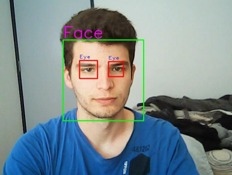
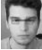
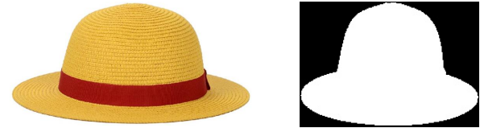
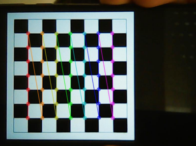
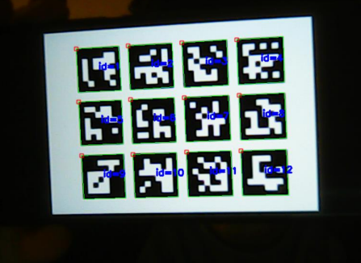
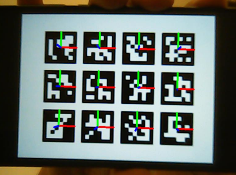
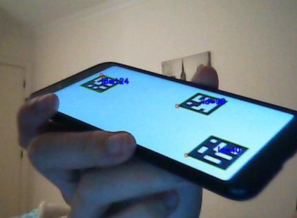
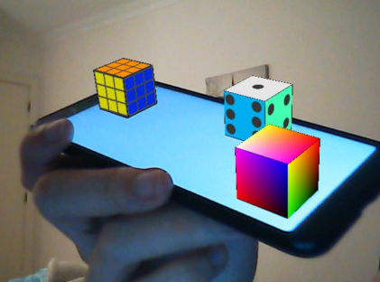

# Augmented reality and face recognition
## Face detection and recognition to include virtual elements
1. First, facial detection is performed using a CNN (convolutional neural network).
2. Then, normalization of the face is applied to obtain the face always in the same position, as well as the eyes and mouth.
3. Next, there is a need to reduce the dimensionality of the images, which is achieved through PCA (Principal Component Analysis).
4. Following this, an algorithm is applied to calculate which person is based on the images stored; in this case, the KneighborsClassifier was used.
5. Then, normalization of the image containing the object is applied.
6. Finally, the object is added to the face.

<table>
  <tr>
    <td></td>
    <td></td>
    <td></td>
</tr>
  <tr>
    <td style="text-align: center;"><em>1. Face detection</em></td>
    <td style="text-align: center;"><em>2. Normalization   of the face</em></td>
    <td style="text-align: center;"><em>4. Object and normalization</em></td>
  </tr>
</table>

<table>
  <tr>
    <td></td>
</tr>
  <tr>
    <td style="text-align: center;"><em>6. Result image</em></td>
  </tr>
</table>

## Augmented reality 
1. The objective is to add 3D objects when see a marker.
2. For this, firstly, it is necessary to calibrate the camera.
3. Then comes the detection of the markers.
4. Then it is necessary to estimate the pose of the marker.
6. Finally, the 3D object can be applied.

<table>
  <tr>
    <td></td>
    <td></td>
    <td></td>
</tr>
  <tr>
    <td style="text-align: center;"><em>2. Camera calibration</em></td>
    <td style="text-align: center;"><em>3. Markers detection</em></td>
    <td style="text-align: center;"><em>4. Pose estimation</em></td>
  </tr>
</table>

<table>
  <tr>
    <td></td>
    <td></td>
</tr>
  <tr>
    <td style="text-align: center;"><em>6. Result mark detection</em></td>
    <td style="text-align: center;"><em>6. Result application of objects</em></td>
  </tr>
</table>